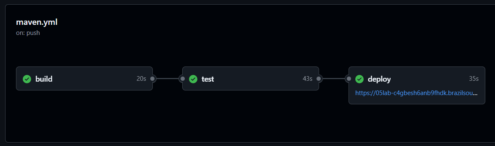
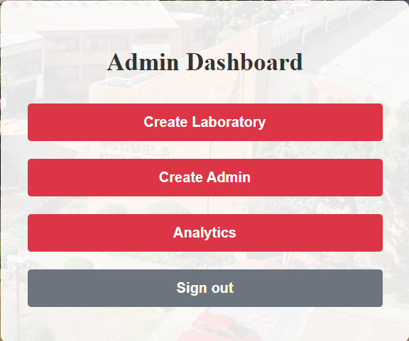
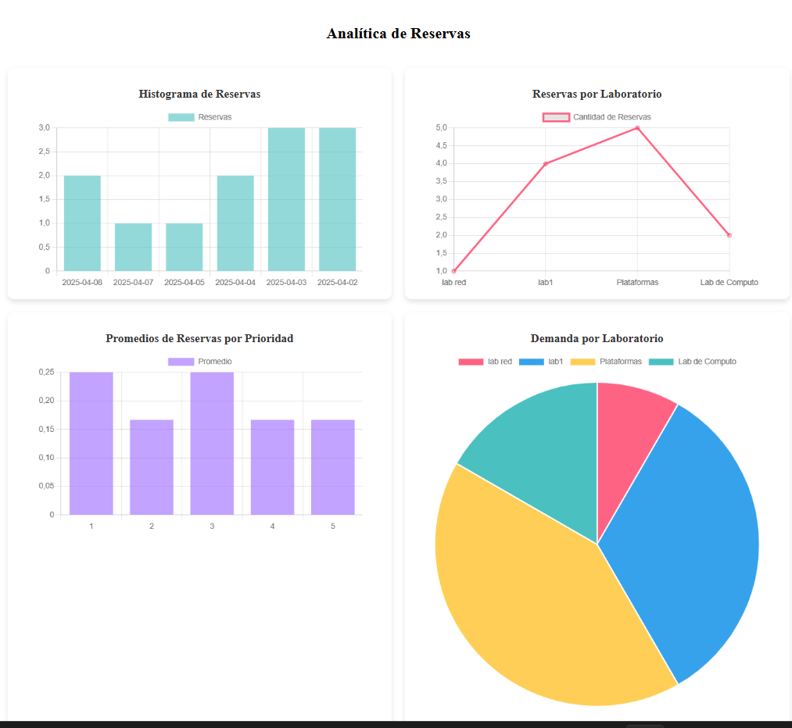

# Laboratorio 05 - CVDS

## PARTE I. DEVOPS / CI-CD

La integración y entrega continua (CI/CD) es un proceso clave en el desarrollo de software que automatiza la construcción, prueba y despliegue de aplicaciones. En GitHub Actions, este proceso se define mediante flujos de trabajo que se activan en eventos específicos, como cambios en el código o solicitudes de incorporación (pull requests).

### Procesos

1. Build (Construcción de la Aplicación)
   El proceso comienza con la fase de build, donde el código fuente se descarga y se compila para asegurar que no haya errores de sintaxis o dependencias faltantes. Se utiliza Maven para limpiar el proyecto, resolver las dependencias y generar los archivos compilados. Esta fase garantiza que el código es válido y está listo para las pruebas.

2. Test (Pruebas Automatizadas)
   Después de la compilación, se ejecutan pruebas unitarias y de integración. Estas pruebas validan que las funcionalidades del backend funcionan correctamente y que no hay regresiones en el código. Los resultados de las pruebas se almacenan como artefactos, junto con el archivo .jar generado. Esta fase es crucial para mantener la calidad del software y detectar errores antes de desplegarlo.

3. Deploy (Despliegue en Producción)
   Si las pruebas se completan con éxito, la aplicación se despliega automáticamente en un entorno de producción. En este caso, el backend se sube a Azure App Service, utilizando credenciales seguras almacenadas en GitHub Secrets. Esto permite que la aplicación esté disponible sin intervención manual, garantizando entregas rápidas y eficientes.

### Creando los Pipelines (CI - Continous Integration)

En esta fase del desarrollo del proyecto, se implementó la Integración Continua (CI) utilizando GitHub Actions, una herramienta que permite definir flujos de trabajo automatizados para gestionar el ciclo de vida del software. Esto permitió la creación de un pipeline estructurado, facilitando la construcción, prueba y despliegue del backend de manera eficiente y sin intervención manual.

La integración continua (CI) tiene como objetivo detectar errores de forma temprana, asegurando que cada cambio en el código se valide correctamente antes de fusionarse en la rama principal (main). Gracias a GitHub Actions, cada vez que se realiza un push o una pull request, se activa un workflow, que ejecuta una serie de tareas definidas en el archivo de configuración del pipeline.

Este workflow sigue una secuencia clara de pasos:

Descarga del código fuente: Se obtiene la última versión del repositorio.

Configuración del entorno: Se instala Java y Maven, asegurando la compatibilidad con el proyecto.

Compilación del código: Se ejecuta mvn clean compile para verificar que no haya errores en la construcción.

Ejecución de pruebas: Se corren pruebas automatizadas con mvn verify, permitiendo detectar posibles fallos.

Generación de artefactos: Se almacena el archivo .jar resultante para su uso en el despliegue.

La automatización de estos pasos evita la dependencia de procesos manuales y garantiza que cada cambio en el código cumpla con los estándares de calidad antes de avanzar a la siguiente fase del desarrollo.

## Despliegue exitoso en GitHub Actions

### Desplegando en Azure usando CI/CD (Continous Deployment / Continous Delivery)

Una vez que la aplicación ha sido construida y probada correctamente, el siguiente paso dentro del pipeline de CI/CD es el despliegue automático en un entorno de producción. En este caso, se utilizó Azure App Service, un servicio en la nube de Microsoft que permite hospedar aplicaciones web sin necesidad de gestionar la infraestructura.

## App Service creado en azure

## Pruebas en Postman

## Verificación del funcionamiento del App Service

## PARTE II. GRÁFICOS

### Generación de datos por procedimientos

En esta fase del desarrollo, se creó una interfaz para el administrador, permitiendo la visualización de datos y análisis sobre los laboratorios y reservaciones. Además, se añadieron características como la gestión de prioridades y otros requisitos visuales para mejorar la experiencia del usuario.

