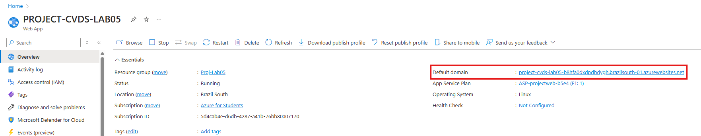
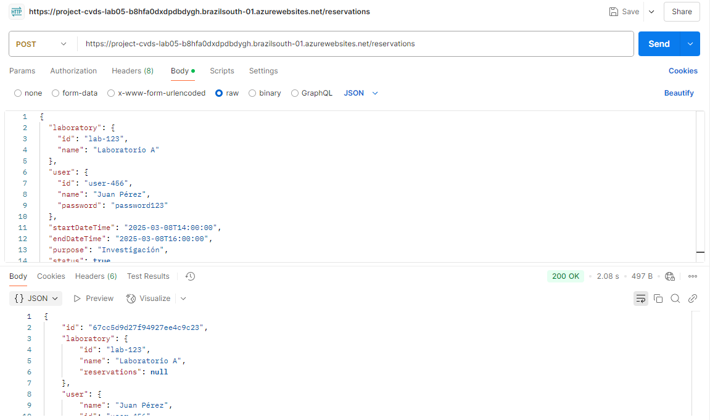

## Configuración Inicial

El flujo de CI/CD se compone de dos jobs:

1. **Build**:
    - Descarga el código del repositorio.
    - Configura JDK 17.
    - Compila el proyecto con Maven.
    - Genera un artefacto `.jar` para despliegue.

2. **Deploy**:
    - Descarga el artefacto generado en el paso anterior.
    - Inicia sesión en Azure.
    - Despliega la aplicación en Azure App Service.

## Problema de Autenticación en Azure

Inicialmente, el `deploy` falló debido a problemas con la autenticación en Azure. El error reportado en GitHub Actions fue:

El problema surgió porque en el `deploy` se intentó autenticar en Azure mediante las siguientes credenciales en GitHub Secrets:

```yaml
client-id: ${{ secrets.AZUREAPPSERVICE_CLIENTID }}
tenant-id: ${{ secrets.AZUREAPPSERVICE_TENANTID }}
subscription-id: ${{ secrets.AZUREAPPSERVICE_SUBSCRIPTIONID }}
```

Sin embargo, no se pudo descargar el **Publish Profile**, ya que Azure requería una version de pago para poder descargarla.

### Solución Implementada

Se optó por **configurar credenciales federadas** en Azure en lugar de utilizar el método basado en contraseñas. Esto permitió la autenticación segura sin necesidad de almacenar credenciales sensibles en GitHub Secrets.

Como resultado, se eliminó la siguiente línea del archivo `.yml`, que anteriormente manejaba la autenticación mediante Publish Profile:

```yaml
publish-profile: ${{ secrets.AZURE_APPSERVICE_PASSWORD }}
```

Ahora, el despliegue usa autenticación con credenciales federadas, las cuales permiten que GitHub Actions se autentique en Azure sin necesidad de almacenar contraseñas, lo que mejora la seguridad y evita problemas de autenticación.

## Resultado Final

Después de realizar estos ajustes, la aplicación se desplegó correctamente, para poder comprobar esto, se tomo el link que arroja Azure.


Esta URL se pone en Postman, para poder simular la creacion de una reserva.


El 200 ok representa que todo salio bien, debido a esto se puede poner la URL en Google y deberia aparecer la reserva creada, esto significa que el despliegue salio bien


## Autores
* **Cristian David Silva Perilla** - [CRISTIANSILVAP](https://github.com/CRISTIANSILVAP)
* **Juan Miguel Rojas Chaparro** - [juanmiguelrojas](https://github.com/juanmiguelrojas)
* **Laura Natalia Perilla Quintero** - [Lanapequin](https://github.com/Lanapequin)
* **Santiago Amaya Zapata** - [SantiagoAmaya21](https://github.com/SantiagoAmaya21)